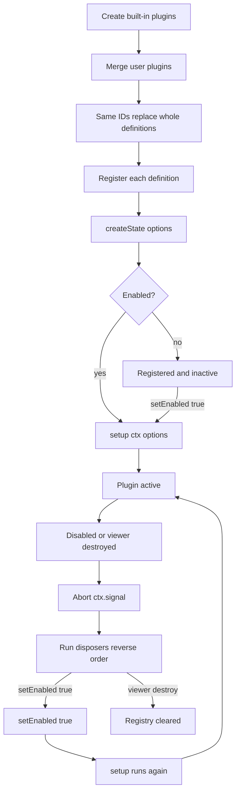

# Plugin lifecycle

The viewer turns plugin definitions into active registrations, then tears those registrations down when a plugin is disabled or the viewer is destroyed.



## Built-in plugins are created

`useVPdfViewer` / `VPdfViewer` call `createBuiltinPlugins()`. That array is always the starting set. Direct `new PluginManager(...)` / `createPluginManager(...)` does **not** add built-ins. See [Advanced](/plugins/advanced).

## User plugins merge

```ts
mergeViewerPlugins(createBuiltinPlugins(), params.plugins?.plugins)
```

- A user plugin whose `id` matches a built-in **replaces** that built-in in place.
- A user plugin whose `id` is new is **appended**.
- Replacement is the whole definition: `setup`, `options`, `enabled`, and `createState` are not merged field-by-field.

## Each definition is registered

`PluginManager` registers merged definitions in array order. `register(definition)`:

- Returns immediately if the manager is already disposed.
- **Throws** `[vpdf] plugin already registered: <id>` if the id is already in the registry.
- Resolves enabled as `plugins.enabled[id] ?? definition.enabled ?? true`.
- Calls `createState(definition.options)` when provided and stores the result.
- If enabled, starts `activate(id)` without awaiting it.

`plugins.enabled` is snapshotted here. Later edits to that object do not change the registry.

## Plugin state is created once

`createState` runs at register, not at activate. Disable / re-enable keeps the same bag. `unregister` (advanced) drops the entry, including state.

## `setup` runs

`activate`:

1. Skips if the entry is missing, already `active`, disabled, or the manager is disposed.
2. Creates a new `AbortController` and sets `active = true`.
3. Builds a [plugin context](/plugins/context) whose `signal` is that controller’s signal.
4. `await definition.setup(ctx, definition.options)`.
5. If the return value is a function, it is pushed onto the plugin’s disposer list.

If `setup` throws, the manager logs the error and calls `deactivate(id)`. The plugin remains **enabled** and **inactive**. `activate` will not retry until `setEnabled(false)` then `setEnabled(true)`.

`setup` may be async. There is no post-`await` check for `signal.aborted`. If the plugin is disabled while `setup` is still awaiting, a disposer returned after that await can still be stored. Keep long-running setup abort-aware with `ctx.signal`.

Because `register()` does not await `activate()`, an async `setup` that waits before calling `register*` can interleave with other plugins. Do synchronous registrations at the start of `setup` when order matters (shortcuts especially).

## Plugin is active

While `active` is true, toolbar items, panels, shortcuts, and other registrations stay in the manager views. Viewer events reach handlers registered with `ctx.on`.

## Disable or destroy

| Trigger | What runs |
| --- | --- |
| `setEnabled(id, false)` | `deactivate(id)` |
| `unregister(id)` | `deactivate(id)`, then delete the registry entry |
| `destroy()` / `plugins.dispose()` | `deactivate` every plugin, then clear the registry and all views |

`deactivate(id)`:

1. Aborts `ctx.signal`.
2. Clears the current modal if this plugin owns it.
3. Runs disposers in **reverse** registration order.
4. Sets `active = false`.

It does not itself empty the toolbar/panel lists. Those entries disappear because their `register*` disposers run.

## Cleanup {#cleanup}

Every `register*` method and `ctx.on` is tracked. You do not have to return those disposers from `setup` for disable/destroy to unregister them.

Return a setup disposer for work the manager cannot track:

```ts
setup(ctx) {
  const stop = watch(
    () => ctx.viewerHost.value,
    (host) => {
      /* bind gestures */
    },
    { immediate: true },
  );

  ctx.signal.addEventListener("abort", () => {
    pending.abort();
  });

  return () => {
    stop();
  };
}
```

Calling a `register*` disposer yourself unregisters that item immediately and removes it from the tracked list.

::: tip
Keep the disposer if you need to unregister early (for example after a one-shot overlay). Otherwise let plugin disable / viewer destroy run it.
:::

Clean up Vue `watch` / `watchEffect` stops, `window` / `document` listeners you added, gesture bindings, observers, timers, and plugin-owned DOM. `ctx.on` and `register*` are already covered.

### `ctx.signal` {#ctxsignal}

A new `AbortSignal` is created on each activation. It aborts when the plugin is deactivated (disable, unregister, or viewer destroy).

`openModal` no-ops when `signal.aborted` is true. Other context methods do not check the signal. Use it to cancel fetches, print jobs, or other async work:

```ts
ctx.signal.addEventListener("abort", () => worker.terminate(), { once: true });
```

## Re-enable

`setEnabled(id, true)` calls `activate` again:

| Concern | Re-enable behavior |
| --- | --- |
| `setup` | Runs again |
| `createState` | Not rerun |
| Plugin state bag | Same object / last `setPluginState` value |
| `ctx.signal` | New `AbortSignal` |
| Registrations | Must be created again inside `setup` |

## Viewer destruction

`VPdfViewer` calls `api.destroy()` on unmount. `useVPdfViewer`’s `destroy()`:

1. `plugins.dispose()` — deactivates plugins and **clears event handlers**
2. `engine.destroy()` — closes the document and would emit `onDocumentClose`

Plugin `ctx.on("onDocumentClose")` handlers do **not** run on viewer teardown. They run when `controller.close()` unloads a document, or when a new `load()` replaces the current one, while the plugin is still active.

After `dispose()`, `register()` is a silent no-op. Create a new viewer / composable instance rather than reusing a disposed manager.

## Stages at a glance

| Stage | What exists |
| --- | --- |
| Definition created | Your factory returned a `VPdfPluginDefinition` |
| Merged | Built-in replaced or user plugin appended |
| Registered | Registry entry, `createState` result, enabled flag |
| Setup | Context created, `setup` running |
| Active | Registrations visible, events delivered |
| Disabled | Signal aborted, disposers ran, entry still in registry |
| Destroyed | Registry and views empty |
