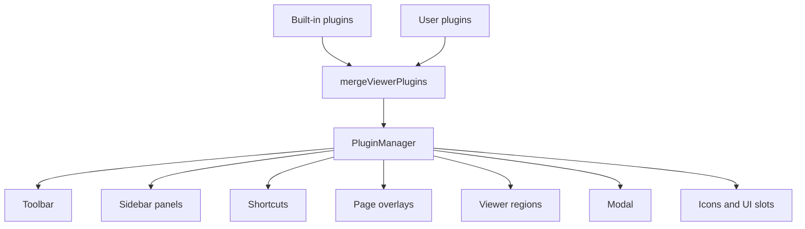

# Plugin system

A plugin is a [`VPdfPluginDefinition`](/plugins/types/#vpdfplugindefinition): an object with a unique `id` and a `setup(ctx)` function. The viewer runs `setup` with a [plugin context](/plugins/context) so the plugin can register UI, listen to events, and call the viewer controller.

Write a plugin when you need viewer UI or behavior that is not in the default shell: a toolbar item, overflow command, sidebar panel, page overlay, shortcut, modal, icon renderer, or a reaction to document events.

Core ships generic hosts. The default toolbar and sidebar are implemented as [built-in plugins](/plugins/built-ins) that honor `options.toolbar` and `options.features`. Optional features such as Open, Print, page layout, Iconify, and XFA thumbnail rasterization live in [separate packages](#built-in-vs-user-vs-extension).



## What plugins can extend

| I want to... | Use |
| --- | --- |
| Add a toolbar button | `registerToolbarItem` |
| Add a custom toolbar widget | `registerToolbarItem` with `kind: "control"` |
| Add an overflow action | `registerMenuItem` or `placement: "overflow"` |
| Add a sidebar tool | `registerPanel` |
| React to keyboard input | `registerShortcut` |
| Render over PDF pages | `registerPageOverlay` |
| Add content to a viewer region | `registerControl` |
| Show a dialog | `openModal` |
| Replace a viewer primitive | `registerUiComponent` |
| Replace UI icons | `registerIconRenderer` |
| Rasterize XFA sidebar thumbnails | `registerXfaThumbnailRasterizer` |
| React to viewer events | `ctx.on(...)` |
| Notify the host with a typed event | `ctx.emit(...)` |
| Share plugin-specific data | `createState` / `getPluginState` / `setPluginState` |

See [Registration APIs](/plugins/registration) for each host.

Two distinctions that are easy to miss:

- **Toolbar control vs viewer-region control.** `registerToolbarItem({ kind: "control" })` puts a Vue component in the toolbar (zoom select, page number). `registerControl` puts a component in `viewer-top`, `viewer-bottom`, or `page-overlay-host` (search bar, print progress).
- **Page overlay vs `page-overlay-host`.** A page overlay teleports into each PDF page and receives `pageNumber`. A `page-overlay-host` control is one layer over the whole page stack.

Plugin authors stay on [`VPdfPluginContext`](/plugins/types/#vpdfplugincontext) inside `setup`. [PluginManager](/plugins/advanced) is for custom shells and headless hosts.

## How plugins are loaded

`VPdfViewer` and `useVPdfViewer` both create a `PluginManager` like this:

1. `createBuiltinPlugins()` builds the ten core plugins.
2. `mergeViewerPlugins(builtins, plugins.plugins)` merges user plugins.
3. `PluginManager` registers each merged definition.
4. For each registered plugin, `createState(options)` runs if provided.
5. Enabled plugins call `setup(ctx, options)`.

[`VPdfPluginsConfig`](/plugins/types/#vpdfpluginsconfig):

```ts
import type { VPdfPluginsConfig } from "@whykhamist/vpdf";

const plugins: VPdfPluginsConfig = {
  plugins: [MyPlugin()],
  enabled: { "vpdf.download": false },
};
```

```vue
<VPdfViewer :src="src" :plugins="plugins" />
```

```ts
const api = useVPdfViewer({ options, plugins });
```

`useVPdfViewer` requires an `options` ref. See [Writing a plugin](/plugins/writing).

## Built-in vs user vs extension {#built-in-vs-user-vs-extension}

| Plugin type | How it is supplied | Examples |
| --- | --- | --- |
| Built-in | Created by `createBuiltinPlugins()` inside `@whykhamist/vpdf` | Navigation, zoom, search, annotations, sidebar panels |
| User | Objects in `VPdfPluginsConfig.plugins` | Your `MyPlugin()` |
| Extension package | Installed separately, then passed as a user plugin | Open, Print, page layout, Iconify, XFA thumbnail raster |

Extension packages are user plugins at runtime. They are not created by `createBuiltinPlugins()`. Installing a package does nothing until you put its factory in `plugins.plugins`.

::: warning
User plugins are merged after built-ins. A user plugin with the same `id` as a built-in plugin replaces the built-in definition entirely. Options, `setup`, and `enabled` are not merged field-by-field.
:::

```ts
import { VpdfAnnotationsPlugin } from "@whykhamist/vpdf";

const plugins = {
  plugins: [
    VpdfAnnotationsPlugin({ editorComponent: CustomEditor }),
  ],
};
```

Give custom plugins unique ids such as `my-app.marks`. Reusing `vpdf.zoom` replaces zoom; it does not add a second zoom control.

## Enable and disable {#enable-and-disable}

A plugin is enabled when:

```
plugins.enabled[id] ?? definition.enabled ?? true
```

That value is snapshotted at `register()`. Changing `plugins.enabled` later does nothing. Use `PluginManager.setEnabled(id, boolean)` for runtime toggles.

Disabling a plugin aborts `ctx.signal`, closes that plugin’s modal, and runs its disposers. Re-enabling runs `setup` again. `createState` is **not** rerun. Details: [Lifecycle](/plugins/lifecycle).

Built-in UI also honors `options.toolbar` and `options.features`. That hides chrome without deactivating the plugin. See [Features and toolbar](/guide/features#built-in-plugins-honor-both).

## Where to go next

1. [Writing a plugin](/plugins/writing) — smallest valid plugin and `VPdfPluginDefinition`
2. [Lifecycle](/plugins/lifecycle) — merge, setup, disable, abort, destroy
3. [Registration APIs](/plugins/registration) — toolbar, panels, shortcuts, overlays
4. [Custom plugin example](/examples/custom-plugin) — working demo
